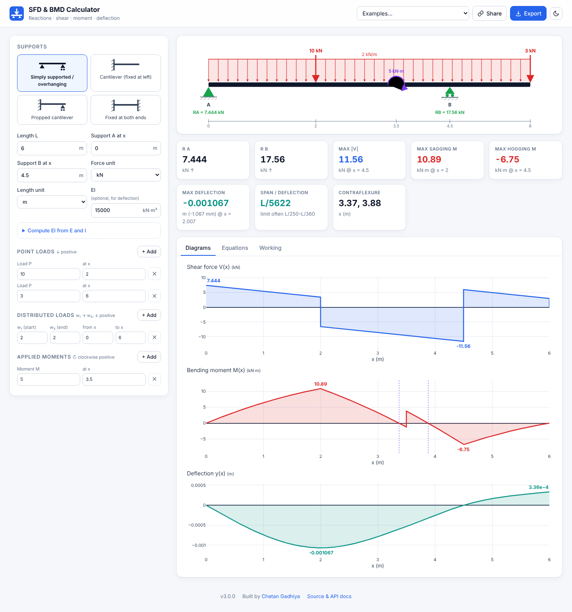
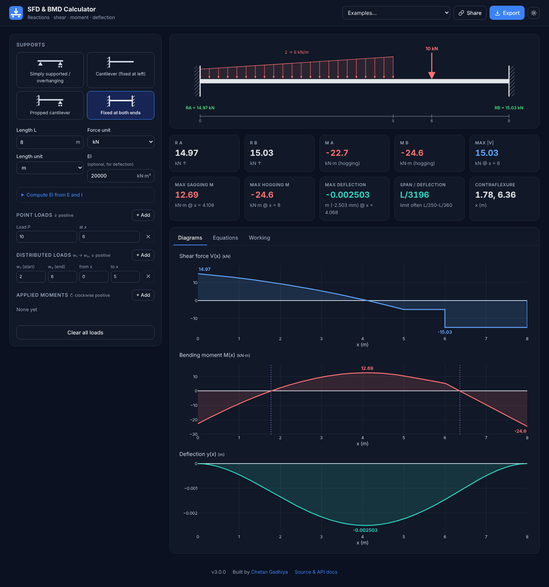

<div align="center">

# 📐 SFD & BMD Calculator

**Beam analysis that updates as you type: reactions, shear force, bending moment, slope and deflection.**

Simply supported, overhanging, cantilever, **propped cantilever** and **fixed-fixed** beams · point, uniform, triangular/trapezoidal and moment loads · interactive charts · step-by-step working · PDF report.

[](https://github.com/ChetanGadhiya017/SFD-BMD-Calculator/actions/workflows/ci.yml)




</div>

---

## ✨ Features

### Analysis
| | |
|---|---|
| 🏗️ **5 support types** | Simply supported · overhanging (supports anywhere) · cantilever · propped cantilever · fixed at both ends |
| ⬇️ **Loads** | Any number of point loads, **linearly varying** distributed loads (UDL, triangular, trapezoidal, partial) and applied couples |
| 🧮 **Indeterminate beams** | Solved by the method of consistent deformations. You get the reactions and fixed-end moments without needing EI |
| 📉 **Deflection** | Enter EI (or compute it from E × I) to get slope, deflected shape, max deflection and the span/deflection ratio |
| 📊 **Results** | Reactions, support moments, max \|V\|, max sagging & hogging moment with positions, points of contraflexure |
| 📝 **Learn the method** | *Working* tab shows the equilibrium / compatibility steps; *Equations* tab gives V(x) and M(x) for every segment |

### Experience
- ⚡ **Live**: recalculates as you type, with an SVG beam preview showing supports, loads, reactions and dimensions
- 📈 **Interactive charts**: SFD, BMD and deflection with synced hover cursor, peak labels and contraflexure markers
- 🔗 **Share**: the whole beam is stored in the URL. Copy the link and anyone opens the same problem
- 📤 **Export**: PDF report, CSV data (x, V, M, θ, y), JSON definition, PNG charts
- 🌙 **Dark mode** (follows your system), works on phones, remembers your last beam

<p align="center"></p>

---

## 🚀 Run it

```bash
git clone https://github.com/ChetanGadhiya017/SFD-BMD-Calculator.git
cd SFD-BMD-Calculator
pip install -r requirements.txt
python app.py                         # → http://127.0.0.1:5000
```

**Docker**

```bash
docker build -t sfd-bmd .
docker run -p 8000:8000 sfd-bmd       # → http://localhost:8000
```

**Deploy:** `render.yaml` is included for one-click deployment on [Render](https://render.com). Any host that runs `gunicorn "app:create_app()"` works.

---

## 💻 Command line

```bash
python -m beam_solver -L 6 --point 10@2
python -m beam_solver -L 6 --supports 0 4.5 --udl 2@0-6 --point 10@2 --moment 5@3.5 --plot beam.png
python -m beam_solver -L 8 --support fixed_fixed --vload 2,6@0-5 --point 10@6 --EI 20000 --equations
```

```
Reactions
  R_A  =     14.971 kN
  R_B  =     15.029 kN
  M_A  =    -22.695 kN·m
  M_B  =    -24.596 kN·m
Extremes
  M sag    =     12.685 kN·m   at x = 4.108 m
  Contraflexure at x = 1.777, 6.363
  y max    =  -0.002503 m       at x = 4.068 m
Equations
  0 < x < 5:  V = −0.4x^2 − 2x + 14.97   M = −0.1333x^3 − x^2 + 14.97x − 22.7
  ...
```

---

## 🔌 REST API

| Method | Endpoint | Returns |
|---|---|---|
| `POST` | `/api/solve` | Reactions, extremes, working, segment equations and plot series |
| `POST` | `/api/report.pdf` | A4 PDF report |
| `POST` | `/api/export.csv` | x, V, M (and slope, deflection) table |
| `GET` | `/api/presets` | Example beams |
| `GET` | `/api/health` | Status + version |

```bash
curl -X POST http://127.0.0.1:5000/api/solve -H "Content-Type: application/json" -d '{
  "kind": "propped_cantilever", "length": 8, "EI": 25000,
  "distributed": [{"w1": 4, "w2": 4, "a": 0, "b": 8}],
  "point_loads": [{"P": 10, "x": 3}],
  "moments": [],
  "series": false
}'
```

| Field | Meaning |
|---|---|
| `kind` | `simply_supported`, `cantilever`, `propped_cantilever`, `fixed_fixed` |
| `length`, `support_a`, `support_b` | Span and support positions (supports default to the ends) |
| `point_loads` | `[{"P": 10, "x": 2}]`, downward positive |
| `distributed` | `[{"w1": 0, "w2": 6, "a": 0, "b": 4}]`, intensity at `a` → at `b` |
| `moments` | `[{"M": 5, "x": 3}]`, clockwise positive |
| `EI` | Optional flexural rigidity (force·length²) for slope & deflection |
| `units` | `{"force": "kN", "length": "m"}` for report/CSV labels |

---

## 📏 Sign convention

Loads ↓ positive · applied moments ↻ positive · reactions ↑ positive · shear = net upward force **left** of the section · sagging moment positive · deflection ↑ positive.

---

## 🧠 How it works

1. **Determinate beams:** reactions from ΣFy = 0 and ΣM = 0 about a support.
2. **Indeterminate beams:** the right-hand restraint is released to leave a cantilever. Its deflection (and slope) at the release point is computed for the loads and for unit redundants, then the compatibility equations are solved.
3. **Internal forces:** V(x) and M(x) are summed from every action left of each section on a dense grid. Each load position is sampled on both sides, so jumps are exact.
4. **Deflection:** θ = ∫M/EI dx and y = ∫θ dx, with constants from the support conditions.
5. **Segment equations:** between consecutive key points V is a polynomial of degree ≤ 2 and M of degree ≤ 3, so they are recovered exactly.

All of this is checked against textbook results in **46 automated tests**: Pab/L, wL²/8, 5wL⁴/384EI, PL³/3EI, 3wL/8, −wL²/12, −Pab²/L², wL²/(9√3) and more.

```
beam_solver/   solver.py (maths) · plotting.py (figures + PDF) · __main__.py (CLI)
app.py         Flask API + page
templates/ static/   UI (vanilla JS + Plotly)
tests/         solver, API and CLI tests
```

---

## 🗺 Roadmap

- [ ] Internal hinges and continuous beams (3+ supports)
- [ ] Variable EI along the span
- [ ] Influence lines and moving loads
- [ ] Section design check (bending stress from section properties)

## 📄 License

[GPL-3.0](LICENSE.md) © Chetan Gadhiya
